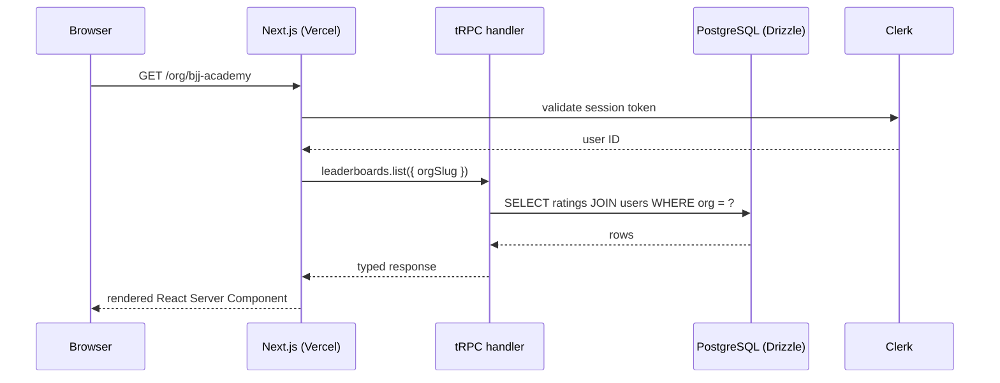
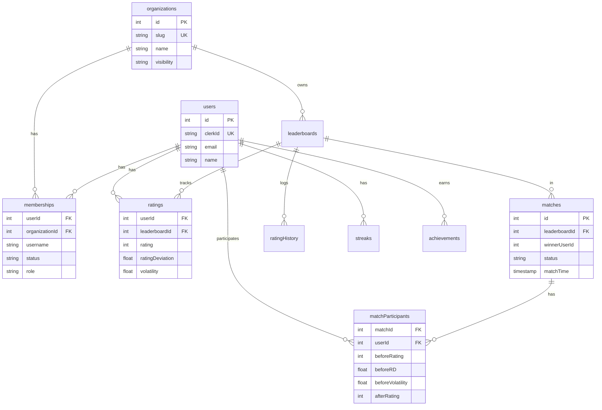
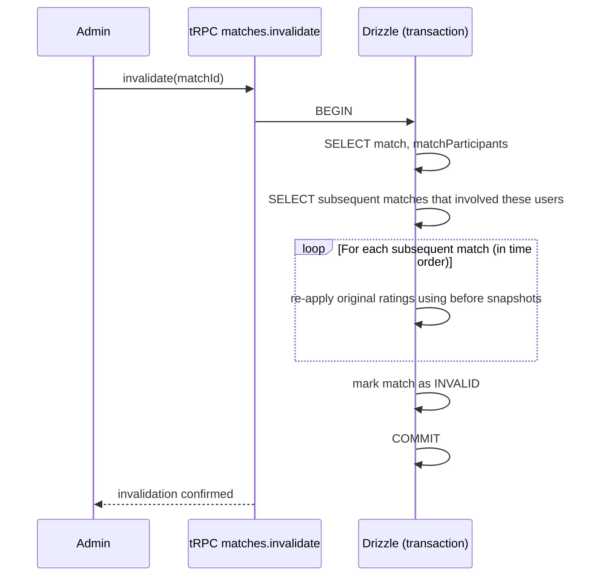
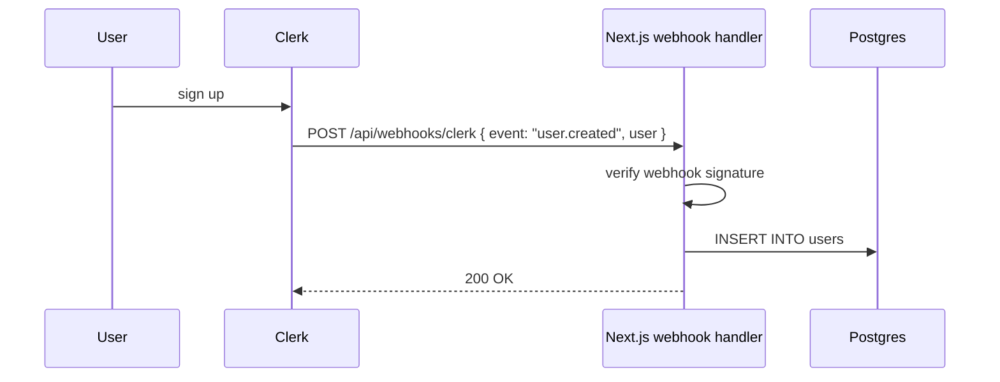

# Architecture

Technical reference for LocalElo. The README covers the user-facing functionality; `docs/PROJECT.md` covers product features in detail; this doc focuses on the engineering architecture.

## Request lifecycle



Every authenticated request flows through Clerk session validation, then a tRPC handler, then Drizzle to Postgres. tRPC gives end-to-end type safety: changing a procedure's signature surfaces as a TypeScript error in the calling component, before the code runs.

## Data model



The unusual columns are on `matchParticipants`: every match stores the rating triple of each participant **before** and **after** the match. This snapshot is what makes match invalidation with rollback possible (see ADR 1).

## Glicko-2 implementation

`src/lib/elo.ts` is a pure-function implementation of the Glicko-2 rating system. Pure means: no I/O, no side effects, no global state. Given a player's current rating triple and a list of match results, return a new triple.

```typescript
export function calculateNewRating(
  player: Player,
  results: MatchResult[]
): Player {
  // Step 1: Calculate variance
  // Step 2: Calculate delta
  // Step 3: Calculate new volatility (Illinois bisection)
  // Step 4: Update phi*
  // Step 5: Update mu
  // Returns new Player object
}
```

Pure functions are testable in isolation: 71 Vitest specs cover the math without touching the database. The transactional layer (Convex/Drizzle) wraps these functions.

## Match invalidation flow



The cascade is the key: invalidating match X means subsequent matches Y, Z that involved the same users had their ratings calculated against the wrong baseline. The system replays them from the before-snapshots in time order, re-applying each match with the corrected starting state.

## Webhook-driven Clerk sync

When a user signs up via Clerk, the application receives a webhook event. The handler at `app/api/webhooks/clerk/route.ts` writes the user's basic info (Clerk ID, email, name) to the local `users` table.



Why webhooks instead of looking up Clerk on every request: avoids a network call on the hot path. The local `users` table is the source of truth for application data; Clerk owns authentication only.

## Request type flow

tRPC's end-to-end typing means the client and server share the same procedure definitions:

```typescript
// Server (procedure definition)
export const matchesRouter = router({
  create: protectedProcedure
    .input(z.object({
      leaderboardId: z.number(),
      winnerUserId: z.number(),
      loserUserId: z.number(),
    }))
    .mutation(async ({ input, ctx }) => {
      // ... atomic rating update
      return { matchId, newRatings };
    }),
});

// Client (consumed in a component)
const { mutate } = trpc.matches.create.useMutation();
mutate({ leaderboardId: 1, winnerUserId: 5, loserUserId: 7 });
//      ^-- TypeScript validates this against the input schema
```

A typo or schema change surfaces at compile time. No need to keep client and server in sync manually.

## Frontend components

The UI is split between server and client components:

- **Server components**: pages that fetch data and render statically (leaderboards, history, profile pages).
- **Client components**: interactive forms and charts (match logging form, rating history chart).

This split reduces JavaScript shipped to the client. Server components render on the edge and stream HTML; only interactive bits hydrate.

## Gamification subsystems

Three subsystems run independently:

| Subsystem | Trigger | Effect |
|-----------|---------|--------|
| Streaks | Daily Vercel cron | Increment streak counter for users who logged a match today; reset for those who did not |
| Weekly XP tiers | Weekly Vercel cron | Roll up the past week's XP, assign tier (bronze, silver, gold, platinum, champion) |
| Achievements | On match creation | Check unlocking conditions (first win, 10-win streak, rating milestone, etc.) |

Each is a focused module with its own tRPC procedures and Drizzle queries.

## Testing

Vitest specs cover:

- Glicko-2 math (input/output round-trips, edge cases like undefeated player, all-loss player)
- Match invalidation cascade (single-match, multi-match, edge case of invalidating the most recent match)
- Membership state transitions (pending → approved, banned)
- Invite-code generation, redemption, expiry
- Streak detection with freeze tokens
- Weekly XP rollup math

71 specs total. All pass.

## Deployment

- **Frontend**: Next.js 15 on Vercel. Edge-cached server components, CDN-distributed static assets.
- **Database**: PostgreSQL on Vercel Postgres or external (Neon, Supabase).
- **Cron jobs**: Vercel Cron triggers daily streak rollover and weekly XP rollup.
- **Webhooks**: Clerk webhooks point to `/api/webhooks/clerk`.

Environment variables:

- `DATABASE_URL`: Postgres connection string
- `CLERK_SECRET_KEY`: Clerk server-side key
- `NEXT_PUBLIC_CLERK_PUBLISHABLE_KEY`: Clerk client-side key
- `CLERK_WEBHOOK_SECRET`: secret for verifying incoming webhooks
