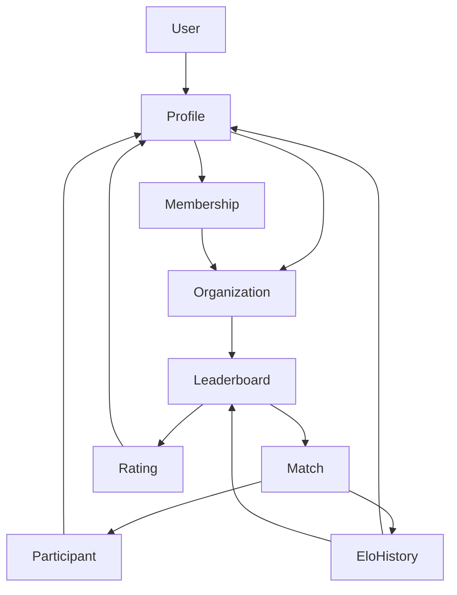

# Domain Concepts Inventory

This document enumerates every user-facing concept that shapes LocalElo's experience. Treat it as the authoritative map of the
product's vocabulary and the operational rules that bind concepts together.

## How to Use This Reference
- **Product & UX** teams can use these notes to align copy, flows, and analytics with the underlying data model.
- **Engineering** should update the relevant concept entry whenever a new state transition, action, or policy is added.
- **Support & Success** can rely on the operational principles to explain “why” outcomes occur (e.g., why a match was rejected).

## Concept Inventory
Each concept below is described using a shared outline:
- **Name** – Canonical term we use in UI copy and documentation.
- **Purpose** – The user or business problem the concept solves.
- **State** – Persistent fields, status flags, or invariants that capture its current condition.
- **Actions** – Primary operations users or systems can perform.
- **Operational Principle** – Rules of thumb that keep the concept consistent, secure, and fair.

### User
| Attribute | Notes |
| --- | --- |
| **Name** | User |
| **Purpose** | Represents an authenticated person who can join organizations, log matches, and view dashboards. |
| **State** | Email, encrypted password, discarded flag, derived profile attributes (username, first/last name), aggregated match stats, linked profile IDs. |
| **Actions** | Sign up/in/out, recover password, view dashboards, join organizations (via profile), log matches through their profiles. |
| **Operational Principle** | Every user must have at least one profile per organization they interact with; deleting/ discarding anonymizes personal data while leaving domain records intact. |

### Profile
| Attribute | Notes |
| --- | --- |
| **Name** | Profile |
| **Purpose** | Captures how a user appears inside a specific organization, including username, bio fields, avatar, and participation history. |
| **State** | Username, first/last name, avatar attachment, organization linkage, uniqueness constraints (one profile per user per organization). |
| **Actions** | Create/update profile when joining an organization, upload avatar, participate in matches, accumulate leaderboard ratings. |
| **Operational Principle** | Profiles are scoped to organizations; they inherit user defaults but must maintain unique usernames within the organization to keep leaderboards unambiguous. |

### Organization
| Attribute | Notes |
| --- | --- |
| **Name** | Organization |
| **Purpose** | Represents a gym, club, or community hub that owns leaderboards, memberships, and match activity. |
| **State** | Name, visibility (`open` or `restricted`), owner/admin flags via memberships, collection of profiles, leaderboards, and matches. |
| **Actions** | Create organizations, approve/deny membership, promote/demote admins, transfer ownership, manage leaderboards, review matches, archive if empty. |
| **Operational Principle** | Organizations mediate every user interaction; access is controlled by membership status and visibility rules, and all leaderboards/matches are scoped to a single organization. |

### Organization Membership
| Attribute | Notes |
| --- | --- |
| **Name** | Membership |
| **Purpose** | Governs a profile's relationship to an organization, including approval workflow and admin privileges. |
| **State** | Status enum (`pending`, `approved`, `banned`), admin boolean, owner flag, timestamps. |
| **Actions** | Request join, approve, ban, promote/demote admin, transfer ownership, revoke membership. |
| **Operational Principle** | Ownership implies admin privileges; each profile can have at most one membership per organization and status transitions must respect approval/banning policies. |

### Leaderboard
| Attribute | Notes |
| --- | --- |
| **Name** | Leaderboard |
| **Purpose** | Defines a competitive ladder inside an organization with its own rating pool and match history. |
| **State** | Name, organization linkage, associated matches and ratings, default enrollment of existing members. |
| **Actions** | Create/delete leaderboards, automatically enroll new members, list rankings, filter matches by leaderboard. |
| **Operational Principle** | Leaderboards always operate within a single organization; creating one bootstraps default ratings for every approved profile so competition can start immediately. |

### Leaderboard Rating
| Attribute | Notes |
| --- | --- |
| **Name** | Rating |
| **Purpose** | Tracks a profile's Elo rating, wins, losses, and draws for a specific leaderboard. |
| **State** | Rating (integer), wins, losses, draws, profile + leaderboard references, default values (1500 rating, 0 stats). |
| **Actions** | Initialize on enrollment, update after matches, inspect historical progress, compute win/loss totals. |
| **Operational Principle** | Ratings exist only in the context of a profile+leaderboard pair; Elo adjustments occur transactionally with matches to keep stats and history synchronized. |

### Match
| Attribute | Notes |
| --- | --- |
| **Name** | Match |
| **Purpose** | Records the outcome between two profiles on a leaderboard, including who won and whether it was a draw. |
| **State** | Leaderboard reference, winner profile (unless draw), draw flag, status (`active` or `invalidated`), elo delta, timestamps. |
| **Actions** | Create match, validate participants, adjust ratings, log histories, invalidate/revert results. |
| **Operational Principle** | Only approved members of the leaderboard's organization can face each other; validation ensures two distinct participants, a single winner (unless draw), and Elo updates run atomically. |

### Match Participant
| Attribute | Notes |
| --- | --- |
| **Name** | Match Participant |
| **Purpose** | Associates a profile with a match and stores per-player Elo before/after values along with winner status. |
| **State** | Match/profile references, Elo snapshots, winner boolean. |
| **Actions** | Created alongside matches, mark winner flag, inspect Elo deltas per participant. |
| **Operational Principle** | Participants must reference unique profiles already eligible for the leaderboard; Elo snapshots capture rating continuity across match creation and potential invalidation. |

### Elo History
| Attribute | Notes |
| --- | --- |
| **Name** | Elo History |
| **Purpose** | Provides a chronological record of rating changes for analytics and charting. |
| **State** | Profile, leaderboard, optional match reference, Elo value, recorded timestamp. |
| **Actions** | Append after matches, query for charts, analyze trends. |
| **Operational Principle** | Histories are append-only records derived from validated matches so dashboards can trust the progression even if matches are later invalidated (they get purged in tandem). |

## Concept Dependence Diagram

## Synchronization Rules
Relationships inherit one of three coordination modes:
- **Free** – Concepts can evolve independently; synchronization is eventual or optional.
- **Collaborative** – Concepts coordinate via shared workflows but tolerate short-term divergence.
- **Synergistic** – Concepts must stay in lockstep; operations commit atomically to preserve invariants.

| Related Concepts | Mode | Rationale |
| --- | --- | --- |
| User ↔ Profile | Collaborative | Users can update account details that cascade to profiles, but organization-specific tweaks remain local. |
| Profile ↔ Membership | Synergistic | Membership status dictates whether the profile is active inside the organization; state transitions update both sides immediately. |
| Organization ↔ Leaderboard | Collaborative | Organizations can exist without leaderboards temporarily, and leaderboards inherit visibility/ownership rules asynchronously. |
| Profile ↔ Leaderboard Rating | Synergistic | Ratings must always reflect the profile's participation state; creation/deletion happens transactionally when memberships change. |
| Leaderboard ↔ Match | Synergistic | Matches are valid only within a leaderboard context; creation triggers immediate validation and rating updates bound to the leaderboard. |
| Match ↔ Match Participant | Synergistic | Participants and matches are created together and share validation/rollback logic. |
| Match ↔ Elo History | Synergistic | Elo history entries are appended (or purged) within the same transaction as match finalization/invalidation. |
| Organization ↔ Membership | Synergistic | Memberships govern access; organization admin changes propagate instantly through membership records. |
| User ↔ Membership (through profile) | Collaborative | User actions (join/leave) initiate membership requests, but approval can lag pending admin review. |
| Leaderboard ↔ Rating ↔ Elo History | Synergistic | Rating adjustments and history logging execute atomically during match processing to avoid drift between current rating and recorded timeline. |

---
**Maintenance Tip:** Whenever you introduce a new domain concept or alter an existing workflow, update this document and the diagram so downstream teams stay aligned.
